# Nhật ký cập nhật hệ thống GreenForecast (Green Arrow Hackathon)

Tài liệu này ghi lại toàn bộ các tính năng, module và kiến trúc hệ thống đã được phát triển, phân chia theo từng thư mục/thành phần chính của dự án.

# Backend
- **Công nghệ lõi**: Sử dụng FastAPI, SQLAlchemy (ORM) và Pydantic (Validation). Hỗ trợ cơ sở dữ liệu linh hoạt (SQLite cho môi trường local/dev và PostgreSQL cho production).
- **Xác thực và Phân quyền (Security & RBAC)**:
  - **Supabase Auth**: Triển khai luồng xác thực JWT bảo mật qua thư viện `gotrue`.
  - **Validation 2 lớp**: JWT được xác thực offline (kiểm tra chữ ký bằng `SECRET_KEY`) và online (xác thực với API của Supabase).
  - **Role-Based Access Control (RBAC)**: Tách biệt quyền thao tác rõ ràng giữa cấp "Tỉnh" (`tinh`) và cấp "Xã" (`xa`) bằng dependency `require_role`.
- **Quản lý Điều hành & Cảnh báo**:
  - Giao diện API mô phỏng việc kích hoạt cảnh báo khẩn cấp (`manual-trigger`). Mọi quyết định đều được ghi vào bảng `AgentDecision` và theo dõi quá trình thực thi.
  - Các cảnh báo đa kênh (SMS, Zalo, Call, Loa phát thanh) đều được tạo thành bản ghi `Notification` có thời gian và trạng thái (delivered, failed, pending).
  - Cung cấp endpoint thao tác nhanh "Gửi lại" (`/resend`) hoặc "Gọi tự động" (`/call`) cho trưởng bản.
- **Bảo mật Kho lưu trữ (AES-256 / RAG)**:
  - Xây dựng module nhận file PDF/DOC/TXT (chỉ thị, công điện) làm ngữ cảnh học tăng cường (RAG) cho LLM.
  - **Mã hóa mức Quân đội (AES-256)**: File được mã hóa byte array bằng thuật toán AES-256 (Fernet) trước khi đẩy lên bucket của Supabase Storage với định dạng `.enc`, ngăn chặn truy cập trái phép.
- **Thống kê & Bộ lọc thời gian (Analytics)**:
  - Xây dựng hàm `get_start_date` ở backend để lọc linh hoạt các dữ liệu Notification, tính toán lại tổng quan kênh phát sóng theo `time_range` (Hôm nay, 24 giờ, 7 ngày, 30 ngày).

# Frontend

## Quá trình phát triển

### Giai đoạn 1 — Khảo sát và tái cấu trúc frontend

- Phân tích giao diện cũ và luồng hoạt động trong file HTML prototype.
- Chuyển frontend thành ứng dụng **Next.js 16.2**, **React 19.2** và **TypeScript**.
- Tách dashboard nguyên khối thành các component theo nghiệp vụ, giảm phụ thuộc giữa layout, dữ liệu và hành vi.
- Sử dụng **SWR** làm lớp truy vấn, cache và tái xác thực dữ liệu frontend.
- Chuẩn hóa biến môi trường cho backend API và Supabase.

### Giai đoạn 2 — Xây dựng lại UX/UI

- Xây dựng app shell gồm navigation rail 236 px, header 72 px và vùng workspace linh hoạt.
- Thay thế giao diện cũ bằng phong cách sáng, tiết chế, phù hợp môi trường điều hành hành chính; không sử dụng Glassmorphism hoặc Dark Mode.
- Đồng nhất font giao diện bằng **Geist Sans** và số liệu bằng **Geist Mono**.
- Chuẩn hóa design token theo OKLCH cho canvas, surface, ink, line, accent và các trạng thái safe/watch/danger.
- Đồng bộ icon bằng `@phosphor-icons/react`.
- Chuẩn hóa button, form, status pill, table, tooltip, toast, modal và slide-over.
- Bổ sung responsive breakpoint cho desktop, tablet và mobile.
- Bổ sung focus state, ARIA label, text label cho trạng thái màu và hỗ trợ `prefers-reduced-motion`.

### Giai đoạn 3 — Tách các màn hình nghiệp vụ

- `Dashboard`: app shell, điều phối view, toast, modal, slide-over và chế độ khẩn cấp.
- `Sidebar`: điều hướng, trạng thái active, tài khoản và các view được bảo vệ.
- `Header`: tiêu đề theo view, bộ lọc thời gian, đồng hồ và trạng thái đồng bộ.
- `OverviewView`: KPI, thống kê kênh, phân bố dân tộc và nhật ký hoạt động.
- `CommunesView`: danh sách địa bàn, dân số, mức tiếp cận và trạng thái.
- `CommuneDetailSlideOver`: chi tiết xã/phường và thôn bản mà không rời màn hình hiện tại.
- `ChannelsView`: thống kê và nhật ký phân phối cảnh báo.
- `PolicyView` và `UploadModal`: danh sách, trạng thái hiệu lực và upload văn bản.
- `RolesView`: trình bày vai trò và quyền truy cập.
- `ResidentsDB`: quản lý dữ liệu dân cư.
- `Login`: luồng xác thực cán bộ và quay lại chế độ quan sát.

### Giai đoạn 4 — Thiết kế lại bản đồ

- Thay marker điểm bằng polygon phân vùng cho từng xã/phường.
- Loại bỏ basemap các khu vực xung quanh, chỉ giữ phạm vi Điện Biên để tránh mất tập trung.
- Bổ sung fill, ranh giới, hover, tooltip, zoom, focus toàn tỉnh, legend và selected state.
- Cập nhật từ lớp 88 đơn vị cũ sang **45 đơn vị hành chính mới**, gồm 42 xã và 3 phường, hiệu lực từ 01/07/2025.
- Hợp nhất polygon GADM 4.1 theo quan hệ sáp nhập trong Nghị quyết 1661/NQ-UBTVQH15.
- Đối chiếu đủ 45/45 tên với `data/maping_location.csv`.
- Lưu bảng ánh xạ mới–cũ tại `data/dien_bien_admin_2025_mapping.csv` và GeoJSON tại `frontend/public/dien-bien-communes.geojson`.

### Giai đoạn 5 — Kết nối dữ liệu và xác thực

- Kết nối các endpoint communes, documents, overview, channels, ethnics, activities, predictions và notifications qua `frontend/lib/api.ts`.
- Tích hợp Supabase Auth cho luồng đăng nhập bằng email hoặc số điện thoại quy ước.
- Lưu access token để gửi Authorization header khi gọi các API cần xác thực.
- Cập nhật logout để gọi `supabase.auth.signOut()` và xóa trạng thái client.
- Hiển thị navigation theo trạng thái đăng nhập và vai trò người dùng.

### Giai đoạn 6 — Hoàn thiện các công cụ quản trị

- `ResidentsDB` đã kết nối GET/POST/PUT/DELETE và import danh sách cư dân.
- Bổ sung validation họ tên, số điện thoại, dân tộc và khả năng đọc SMS.
- CSV parser hỗ trợ dữ liệu có dấu phẩy và dấu nháy kép.
- Bổ sung pagination và bộ lọc theo xã, dân tộc.
- `UploadModal` đã kết nối `POST /api/documents/upload` bằng `FormData`, có validation, loading state và phản hồi lỗi/thành công.
- Bổ sung thao tác bật phiên khẩn cấp, gửi lại cảnh báo và gọi tự động từ màn hình chi tiết.

## Kiến trúc frontend hiện tại

- **Framework**: Next.js 16.2.10, React/React DOM 19.2.7.
- **Data fetching**: SWR 2.4.2.
- **Authentication**: Supabase JS và Supabase SSR.
- **Map**: Leaflet 1.9.4 và GeoJSON nội bộ.
- **Icon**: Phosphor Icons.
- **Typography**: Geist Sans và Geist Mono.
- **Styling**: CSS variables, CSS Grid/Flexbox và responsive media queries trong `frontend/app/globals.css`.

## Tài liệu frontend liên quan

- `DESIGN.md`: design system và quy tắc giao diện.
- `PRODUCT.md`: mục tiêu sản phẩm và nguyên tắc trải nghiệm.
- `app_workflow_v2.html`: luồng màn hình và hoạt động của web.
- `frontend/components/dashboard/`: các view và component dashboard.
- `frontend/lib/api.ts`: lớp kết nối API và chuyển đổi dữ liệu cho UI.
- `frontend/app/globals.css`: design token, layout, responsive và motion.

# Agents
- **Tích hợp LLM**: Tích hợp Google Gemini (gemini-1.5-flash) để đóng vai trò trợ lý sinh văn bản tự nhiên.
- **AI Agent Service**: Xử lý logic nghiệp vụ - khi có thiên tai, AI Agent tự động kết hợp thông tin cấu trúc (dân số, tọa độ) và dữ liệu RAG (từ các văn bản chỉ đạo) để sinh ra bản tin nhắn SMS / kịch bản Voice chuẩn xác gửi đến vùng ảnh hưởng.

# Database
- **Thiết kế Đa tầng**: Sử dụng mô hình Relational DB cho dữ liệu cấu trúc (Tài khoản, Cư dân, Quyết định Agent, Thông báo) và Object Storage (Supabase) để lưu trữ tệp tin.
- **Phân tách Dữ liệu theo Role**:
  - Cấu trúc ràng buộc dữ liệu sao cho Cán bộ Xã chỉ được truy cập, CRUD cư dân và xem báo cáo trong phạm vi `commune_id` của mình. Cán bộ Tỉnh sử dụng Admin SDK để bao quát tổng thể.
- **Dữ liệu Dân cư Chi tiết**: Tối ưu schema lưu trữ thông tin nhân khẩu (Dân tộc, Trình độ học vấn, SĐT) để hệ thống tự động ra quyết định phân loại kênh thông báo (Vd: Gọi điện tiếng dân tộc thay vì gửi SMS text cho người không biết chữ).

## Giai đoạn 7 — Chuẩn hóa cấu hình kết nối Supabase

- Loại bỏ connection string Supabase cũ bị hardcode trong Docker Compose; backend nhận secret lúc chạy từ `backend/.env`, không đưa secret vào image hoặc Git.
- Bổ sung mẫu `backend/.env.example` cho PostgreSQL Session pooler (cổng 5432), Supabase URL, publishable key, service-role key và JWT secret.
- Chuẩn hóa các biến Supabase backend trong `Settings`, tách khỏi các biến `NEXT_PUBLIC_*` chỉ dành cho frontend.
- Giữ nguyên `backend/.env` cục bộ hiện hữu; connection string thật chỉ được bổ sung khi có credential từ Supabase Dashboard.

## Giai đoạn 8 — Khôi phục backend và quản trị schema

- Backend dùng Supabase Session pooler thực tế và đã khởi động ổn định, không còn restart loop khi cấu hình database hợp lệ.
- Bổ sung endpoint `GET /health` trả trạng thái `healthy` hoặc `degraded`, trạng thái database và quy ước schema có version.
- Khi trung tâm dữ liệu không sẵn sàng, dependency database trả HTTP 503 với mã `DATA_CENTER_UNAVAILABLE` thay vì để ứng dụng mất kết nối hoặc crash.
- Loại bỏ `Base.metadata.create_all()` và seed dữ liệu mô phỏng khỏi startup production.
- Thiết lập Alembic cùng revision khởi tạo `0001_initial_schema`; schema Supabase được quản lý bằng `alembic upgrade head`.
- Cập nhật client Supabase backend để ưu tiên `SUPABASE_SECRET_KEY`, tương thích `SUPABASE_SERVICE_ROLE_KEY` cũ và chỉ khởi tạo client đặc quyền tại request cần dùng.
- Xác thực token qua Supabase Auth thay vì hardcode project, API key hoặc JWT signing secret cũ trong source code.

## Giai đoạn 9 — Dữ liệu frontend trung thực và trạng thái mất kết nối

- Loại bỏ fallback `buildModel()` và các KPI/rủi ro mô phỏng khi API dashboard lỗi.
- Không còn suy diễn tỷ lệ tiếp cận bằng jitter hoặc giá trị mặc định; dữ liệu thiếu hiển thị `—` và trạng thái `Chưa xác thực`.
- Bổ sung trạng thái màu, nhãn và pill `Chưa xác thực` trong lớp chuyển đổi dữ liệu frontend.
- Khi không liên lạc được backend, ứng dụng vẫn giữ app shell và hiển thị banner `Mất kết nối tới trung tâm dữ liệu` cùng thao tác thử kết nối lại.
- Kiểm tra Open-Meteo từ container backend thành công; client có timeout, kiểm tra HTTP status và scheduler chỉ ghi dự báo khi database sẵn sàng.

## Giai đoạn 10 — Tương tác bản đồ và tra cứu địa bàn

- Map dùng trạng thái rủi ro từ dữ liệu backend; không còn gán màu hoặc tỷ lệ bằng quy luật mô phỏng theo ID.
- Thêm trạng thái polygon, tooltip và chú giải `Chưa xác thực` cho các địa bàn chưa có dữ liệu vận hành.
- Một lần chọn polygon hoặc dòng danh sách chỉ chọn/focus địa bàn; slide-over chỉ mở qua nút `Xem chi tiết` rõ ràng.
- Smart focus chỉ bay camera khi địa bàn nằm ngoài khung nhìn, thời lượng 250 ms; giảm minZoom để bản đồ toàn tỉnh không bị cắt trên desktop.
- Hiển thị đủ địa bàn từ GeoJSON, bổ sung tìm kiếm keyword không dấu, fallback sai nhẹ tối đa hai ký tự, filter theo trạng thái và tự cuộn danh sách tới polygon được chọn.
- Ổn định lifecycle Leaflet khi SWR tái xác thực dữ liệu: không tái tạo map hoặc làm reset khung nhìn trong lúc người dùng chọn địa bàn; đồng thời làm sạch registry layer trước mỗi lượt khởi tạo.
- Bổ sung trạng thái rỗng `Không tìm thấy địa bàn phù hợp.` cho tổ hợp tìm kiếm/lọc không có kết quả.
- Sửa thao tác cuộn khi chọn xã: chỉ cuộn vùng danh sách nội bộ, không còn kéo cả trang làm bản đồ ra khỏi viewport; focus giữ nguyên mức zoom và chỉ bay tới tâm địa bàn khi tâm nằm ngoài khung nhìn.

## Giai đoạn 11 — Điều hướng mobile

- Chuyển navigation mobile thành bottom navigation cố định, cao 68 px, theo cấu trúc quen thuộc của ứng dụng di động: icon và nhãn ngắn, vùng chạm rõ ràng, có trạng thái mục đang chọn.
- Giữ 5 tác vụ chính trên taskbar: Bản đồ, Tổng quan, Địa bàn, Phân phối và Văn bản; các màn quản trị không làm quá tải điều hướng hiện trường.
- Đưa nhận diện GreenForecast lên đầu màn hình riêng với logo và tên ứng dụng; header nội dung nằm bên dưới, không còn trộn với thanh điều hướng.
- Dành khoảng đệm phía cuối app shell để nội dung không bị taskbar che khuất; duy trì `prefers-reduced-motion` và focus state hiện có.
- Kiểm thử Playwright ở viewport 390 × 844: bottom navigation hiển thị đúng đáy màn hình và chuyển sang Tổng quan thành công.

## Giai đoạn 12 — Rà soát và bàn giao kỹ thuật

- Sửa phép tổng hợp dashboard khi Supabase chưa có dữ liệu: không còn phát sinh `NaN`; các KPI phụ thuộc dân số và trưởng bản hiển thị `—` cùng nhãn `chưa có số liệu xác thực` khi không có bản ghi nguồn.
- Chuẩn hóa hàm định dạng số để giá trị không hợp lệ luôn hiển thị `—`, không lan truyền số giả vào UI.
- Xác nhận runtime: `GET /health` là `healthy`, database `available`, và Alembic ở revision `0001_initial_schema (head)`.
- Xác nhận build production Next.js và Docker image frontend thành công; frontend/backend container cùng đang chạy.
- Luồng map, tìm kiếm, chọn xã, trạng thái rỗng, bottom navigation và Tổng quan dữ liệu trống đã được kiểm thử bằng Playwright.
- Giới hạn bàn giao: phát SMS/Zalo/loa và phát tin AI chưa được kết nối với nhà cung cấp thực. Backend hiện có mã tạo trạng thái gửi hoặc nội dung dự phòng, nên không được xem là bằng chứng thông báo đã được phát ra ngoài hệ thống.

## Giai đoạn 13 — Dọn module prototype frontend

- Rút gọn `frontend/lib/data.ts` thành interface helper nhỏ phục vụ runtime (`fmt`, trạng thái, màu tỷ lệ, pill và khoảng thời gian); loại bỏ toàn bộ dữ liệu xã mô phỏng và các hàm `buildModel`/`buildDetail` không còn được gọi.
- Xóa `frontend/components/dashboard/Shared.tsx` và `frontend/lib/style.ts`, là cụm UI prototype không có import từ runtime tree.
- Cập nhật `frontend/README.md` theo kiến trúc Next.js hiện tại, endpoint backend thực và quy ước không dùng dữ liệu mô phỏng.

## Giai đoạn 14 — Chuẩn hóa Supabase frontend

- Xóa Supabase client cũ tại `frontend/lib/supabase.ts`, vốn không có caller và giữ fallback credential trong source.
- Xóa `frontend/test_supabase.js`, script chẩn đoán không được khai báo trong package workflow.
- Giữ `frontend/utils/supabase/clients.ts` là adapter Supabase phía trình duyệt duy nhất mà `app/page.tsx` và `Login.tsx` sử dụng.
## Giai đoạn 15 — Cô lập Prediction Service

- Tách toàn bộ mã, model, dữ liệu và Dockerfile dự báo ML khỏi root vào `ml-service/`; backend và frontend vận hành không thay đổi, Docker Compose vẫn chỉ khởi chạy hai dịch vụ đó.
- Chuẩn hóa ranh giới: `ml-service/app.py` cung cấp `GET /health` và `POST /forecast`; `ml-service/README.md` ghi rõ đây là service độc lập, chưa được tích hợp để tránh hiển thị dự báo thử nghiệm như dữ liệu vận hành.
- Tách pipeline ML cũ vào `ml-service/legacy/`, kèm README nêu rõ không có caller hiện tại và các đầu việc bắt buộc trước khi tái sử dụng.
- Giữ `data/build_dien_bien_admin_2025.py` và `data/dien_bien_admin_2025_mapping.csv` tại root, kèm `data/README.md`, vì chúng là nguồn địa giới cho bản đồ Điện Biên thay vì dữ liệu ML.
- Thêm `CONTEXT.md` để cố định thuật ngữ Prediction Service, Operational Backend, Administrative Geography Source và Legacy ML Prototype; cập nhật các tài liệu ML liên quan theo đường dẫn mới.

## Giai đoạn 16 — Sửa tương thích Supabase Admin API

- Sửa `GET /api/users` để đọc trực tiếp danh sách do Supabase SDK hiện tại trả về, đồng thời vẫn tương thích với response cũ có thuộc tính `.users`.
- Bổ sung regression test `backend/test_users_router.py` cho contract trả về kiểu `list`, ngăn lỗi `AttributeError: 'list' object has no attribute 'users'` tái diễn.
- Rebuild backend container và xác nhận `/health` healthy; lời gọi Supabase Admin `list_users()` trong container chạy thành công mà không hiển thị secret hoặc dữ liệu tài khoản.

## Giai đoạn 17 — Vòng đời an toàn cho văn bản chỉ đạo

- Thêm migration `0002_document_workflow` với trạng thái upload, dữ liệu bản nháp có hạn, hash nguồn, xóa mềm và các bảng audit/yêu cầu xem bản gốc.
- Tách văn bản chính thức (`approved`) khỏi bản nháp `processing`, `pending_review`, `failed`; chỉ văn bản đã duyệt mới xuất hiện ở danh sách mặc định và được AI Agent sử dụng.
- Bản nháp OCR/SLM được mã hóa riêng, chỉ người upload xem được trong 24 giờ và bị xóa khi xác nhận, hủy hoặc hết hạn; văn bản xóa mềm được giữ 30 ngày.
- API upload nay tạo tác vụ xử lý nền, có endpoint xem/sửa/xác nhận/hủy bản nháp, xóa mềm, khôi phục và gửi yêu cầu xem bản gốc.
- Thêm worker dọn dữ liệu quá hạn theo giờ và giới hạn upload PDF, DOCX, TXT, JPG, PNG, tối đa 20 MB.

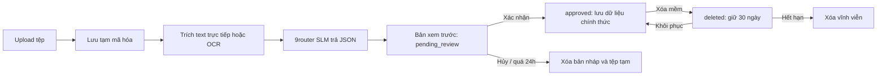

## Giai đoạn 18 — Bản xem trước có cán bộ trong vòng kiểm soát

- Thay upload cũ bằng luồng chọn tệp PDF/DOCX/TXT/JPG/PNG rồi chờ bản nháp xử lý; không còn yêu cầu cán bộ nhập metadata trước khi hệ thống đọc tài liệu.
- Bổ sung modal xem trước UI hóa: trường nguồn bắt buộc, bằng chứng trang trích, chỉnh sửa trực tiếp, tick địa bàn, chính sách hiển thị bản gốc và xác nhận/hủy rõ ràng.
- Thêm tài liệu `docs/DATA_GOVERNANCE.md` mô tả mã hóa, 9router SLM, OCR, retention, phân quyền và audit.
- Frontend build production thành công sau khi nối modal review vào Dashboard.

## Giai đoạn 19 — Quyền xem bản gốc theo yêu cầu

- Bổ sung API gửi yêu cầu xem bản gốc, cấp tỉnh duyệt/từ chối qua web và endpoint stream nội dung chỉ khi quyền còn hiệu lực.
- Yêu cầu không phản hồi tự hết hạn sau 24 giờ; quyền được duyệt cũng hết hạn sau 24 giờ. Cán bộ tỉnh được xem ngay khi văn bản đã bật chính sách tương ứng.
- Việc xem bản gốc được ghi audit event; Storage không cấp URL public hay endpoint tải xuống.

## Giai đoạn 20 — Danh sách văn bản theo vòng đời

- Gộp các trạng thái Đã duyệt, Đang xử lý, Chờ duyệt, Thất bại và Đã xóa vào cùng trang Văn bản chỉ đạo bằng bộ lọc trạng thái.
- Cấp tỉnh mới thấy nút upload; API vẫn áp dụng giới hạn người upload cho bản nháp và trạng thái thất bại.
- Xác nhận lại production build Next.js thành công sau khi bổ sung danh sách và modal review.

## Giai đoạn 21 — Migration tự động khi khởi động backend

- Bổ sung `backend/entrypoint.sh`: chạy `alembic upgrade head` trước khi khởi động Uvicorn.
- Docker image backend chỉ nhận traffic sau khi migration thành công; migration thất bại làm container dừng để tránh chạy API trên schema cũ.

## Giai đoạn 22 — Kiểm tra cấu hình mã hóa tài liệu

- Xác thực khóa Fernet trước mọi thao tác mã hóa/giải mã tài liệu. Khóa sai trả HTTP 503 với mã `DOCUMENT_ENCRYPTION_MISCONFIGURED` thay vì lỗi 500.
- Bổ sung placeholder rõ ràng trong `backend/.env.example`: cần khóa URL-safe Base64 giải mã thành đúng 32 byte.
## Giai đoạn 23 — Chẩn đoán lỗi upload và bản xem trước

- Tái hiện nhánh lỗi 404: khi `draft_analysis_path` chưa được tạo, endpoint bản xem trước trả về `404 Bản nháp phân tích không còn khả dụng`.
- Xác nhận hai nguyên nhân độc lập từ code, log container và trạng thái bản ghi: frontend mở preview ngay sau khi upload trong khi backend còn `processing`; sau đó OCR thất bại vì container có `vietocr` nhưng thiếu gói `torch`.
- Hướng sửa đã xác định: API preview cần trả trạng thái `processing` có thể poll thay vì 404; frontend hiển thị trạng thái đang trích xuất và chỉ hiện form khi `pending_review`; Docker phải cài PyTorch CPU trước VietOCR, đồng thời phản hồi rõ trạng thái `failed` và thông điệp lỗi OCR.

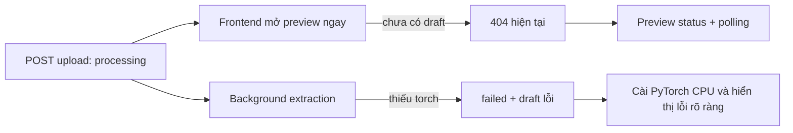

## Giai đoạn 24 — Hoàn thiện luồng chờ xử lý và OCR VietOCR

- Endpoint `GET /api/documents/{id}/preview` trả HTTP `202` cùng trạng thái `processing` khi tác vụ nền chưa tạo bản nháp, thay cho 404 sai ngữ nghĩa.
- Modal xem trước tự polling mỗi 2 giây, hiển thị trạng thái đang trích xuất; form chỉ xuất hiện khi bản nháp sẵn sàng và lỗi OCR hiển thị rõ khi trạng thái thất bại.
- Docker backend cài bộ PyTorch CPU tương thích (`torch 2.5.1+cpu`, `torchvision 0.20.1+cpu`) từ kho PyTorch CPU trước VietOCR. Đã build image, khởi động container và xác nhận VietOCR import thành công; CUDA hiện `false` theo hạ tầng CPU.
- Đã smoke-test OCR thật trên ảnh mẫu trong container. Lần khởi tạo đầu tiên tải trọng số VGG19 khoảng 548 MB vào cache của container; các lần xử lý tiếp theo trên cùng container dùng lại cache này.

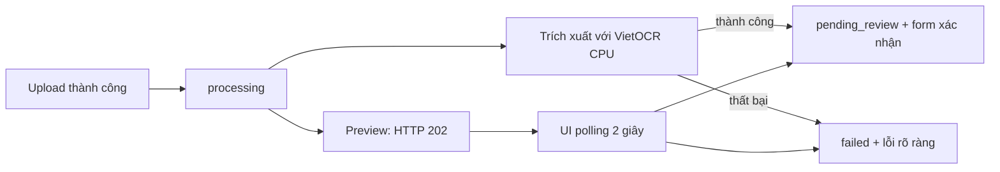

## Giai đoạn 25 — OCR cho PDF scan và DOCX có ảnh

- Bổ sung PyMuPDF để render từng trang PDF scan thành ảnh RGB trước khi gọi VietOCR; lỗi Pillow không nhận diện được byte PDF không còn xảy ra.
- DOCX không có text layer nay đọc các ảnh nhúng trong `word/media`; ảnh/PDF/DOCX scan đều giới hạn 20 trang hoặc ảnh mỗi lần tải để bảo vệ worker CPU.
- Tạo Docker named volume `ocr_model_cache` tại `/root/.cache/torch`, giữ lại trọng số OCR qua các lần recreate container.
- Đã kiểm tra trong container: PDF mẫu được render thành ảnh RGB 1190×1684 thành công.

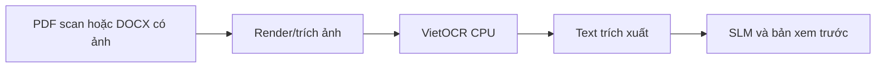

## Giai đoạn 26 — Văn bản không có ngày hết hiệu lực

- Sửa model `Document.end_date` và migration `0003_documents_end_date_nullable`: ngày hết hiệu lực là dữ liệu tùy chọn, phù hợp với văn bản chưa xác định thời hạn.
- Đã rebuild backend để Alembic tự nâng cấp schema và truy vấn PostgreSQL xác nhận cột `documents.end_date` cho phép `NULL`.
- Tài liệu bị rollback khi duyệt vẫn giữ `pending_review`, do đó cán bộ có thể xác nhận lại sau khi refresh mà không phải tải lên lại.

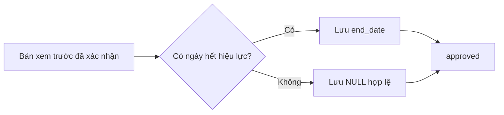
## Giai đoạn 27 — OCR nội bộ theo vùng chữ

- Tích hợp PP-OCRv6 Text Detection chạy CPU trước VietOCR: ảnh trang được phát hiện vùng chữ, cắt theo bounding box và sắp xếp theo thứ tự đọc trước khi recognizer xử lý.
- Bổ sung PaddlePaddle/PaddleOCR, runtime OpenCV cho Docker slim và volume `paddle_model_cache`; trọng số detector và VietOCR được cache qua các lần recreate container.
- Smoke test đầy đủ trên ảnh nội bộ đạt kết quả `VAN BAN CHI DAO`, xác nhận luồng PP-OCR detector → VietOCR hoạt động.

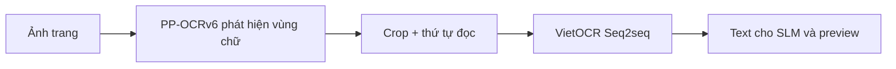
## Giai đoạn 28 — Metadata fallback và trạng thái sau duyệt

- Fallback không dùng SLM nay trích xuất thêm cơ quan ban hành, ngày ban hành và ngày hiệu lực theo mẫu văn bản hành chính tiếng Việt; tóm tắt để trống thay vì ghi thô toàn bộ OCR.
- Sau khi duyệt thành công, UI quay về mục Văn bản chỉ đạo với filter `Đã duyệt` và tải lại danh sách; không giữ nhầm filter `Thất bại` từ lần xác nhận thiếu trường trước đó.
- Xác minh dữ liệu thực tế: văn bản 6 đã ở trạng thái `approved`/`active`; backend không tự đổi văn bản đã duyệt thành thất bại.

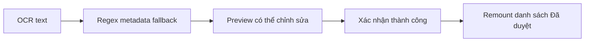
## Giai đoạn 29 — Chuẩn hóa ngày trong bản nháp OCR

- Sửa lỗi `Object of type date is not JSON serializable` khi metadata fallback trích được ngày ban hành hoặc hiệu lực.
- `date` và `datetime` được chuẩn hóa ISO-8601 trước khi bản nháp JSON được mã hóa/lưu trữ; đã rebuild backend và kiểm tra serializer thành công.

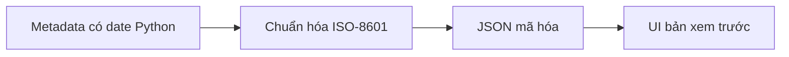
## Giai đoạn 30 — Heuristic cấu trúc văn bản hành chính

- Tiêu đề được nhận diện từ các dòng sau loại văn bản (Quyết định, Chỉ thị, Công văn…), thay vì lấy nhầm dòng header cơ quan.
- Cơ quan ban hành ghép được hai dòng tổ chức–địa danh, ví dụ `ỦY BAN NHÂN DÂN` và `TỈNH ĐIỆN BIÊN`.
- Khi SLM chưa cấu hình, các trường tóm tắt/hành động hiển thị gợi ý nhập thủ công, không ngụ ý nội dung OCR là tóm tắt.

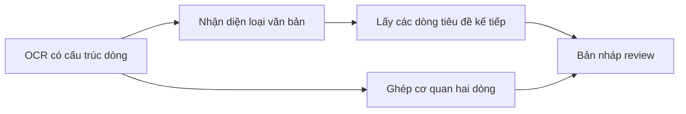
## Giai đoạn 31 — Phân quyền tài khoản công vụ an toàn

- Chuyển `role` và `commune_id` khỏi `user_metadata` sang `app_metadata`; backend chỉ tin các claim do service role quản lý, không cấp mặc định quyền cán bộ tỉnh cho tài khoản mới.
- Chỉ chấp nhận tài khoản `@dienbien.gov.vn`; tài khoản chưa được cấp quyền hoặc chưa gán xã/phường nhận thông báo nghiệp vụ, không lộ chi tiết kỹ thuật.
- Bổ sung màn hình chỉnh sửa tên, vai trò và xã/phường cho cán bộ tỉnh trong mục **Phân quyền**. Cán bộ xã bắt buộc có xã/phường; khi chuyển thành cán bộ tỉnh, xã/phường được xóa khỏi claim.
- Khóa endpoint nạp dữ liệu xã cho cán bộ tỉnh; đã nạp 3 xã vào Supabase Database. Script `scripts/bootstrap_auth_user.py` cấp quyền cho cán bộ tỉnh đầu tiên bằng service role mà không sửa JSON Auth thủ công; đã cấp quyền `tinh` cho `canbotinh@dienbien.gov.vn`.
- Kiểm tra: `python -m unittest test_users_router.py` trong container đạt 2/2; frontend build TypeScript thành công; container khởi động không lỗi migration.

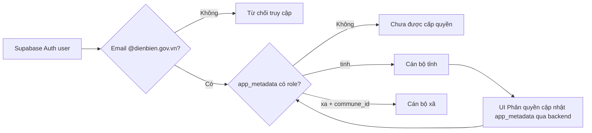
## Giai đoạn 32 — Phân tích nội dung AI không chặn quy trình duyệt

- Bổ sung adapter OpenAI-compatible cho 9router: chỉ gửi phần chữ đã được trích xuất, giới hạn độ dài/timeout qua cấu hình và không ghi API key hoặc nội dung văn bản vào log.
- AI phải trả JSON object; dữ liệu được kiểm tra kiểu, ngày ISO-8601, phạm vi và danh sách xã trước khi hòa vào bản nháp OCR. Dữ liệu sai hoặc response rỗng bị bỏ qua.
- Khi thiếu cấu hình, lỗi mạng hoặc JSON AI không hợp lệ, văn bản vẫn vào `pending_review`; UI hiển thị câu nghiệp vụ **“AI chưa phân tích được nội dung văn bản…”** và cán bộ vẫn chỉnh sửa/xác nhận được.
- Bổ sung audit event hệ thống chỉ ghi trạng thái và model (nếu có), không lưu text gửi nhà cung cấp. UI thay các nhãn SLM kỹ thuật bằng ngôn ngữ dành cho cán bộ.
- Kiểm tra: 2 test AI (fallback + JSON hợp lệ), 2 test quyền tài khoản và frontend TypeScript build đều thành công; backend/frontend đã rebuild.

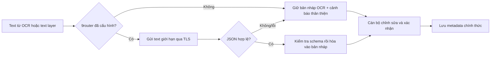
## Giai đoạn 33 — Chi tiết văn bản và bản hiển thị có kiểm soát

- Bấm một dòng văn bản đã duyệt nay mở khung trung tâm hai cột: bên trái là bản PDF hiển thị, bên phải là metadata đã xác nhận gồm cơ quan ban hành, ngày, hiệu lực, địa bàn, tóm tắt và việc cần thực hiện.
- Bảng danh sách bổ sung cơ quan ban hành và địa bàn áp dụng; `commune_ids_json` được chuyển thành danh sách địa bàn cho API/UI, không hiển thị JSON thô.
- Bổ sung kiểm tra quyền xem và endpoint `/display` không trả URL Storage công khai. PDF gốc được hiển thị trực tiếp; ảnh, DOCX và TXT được tạo bản PDF nội bộ trong bộ nhớ để xem trên web.
- Khi chưa có quyền, giao diện có đủ trạng thái: đang gửi yêu cầu, đang chờ duyệt, gửi thất bại rồi tự trả về nút gửi sau 5 giây. Yêu cầu chỉ được tạo qua API có audit log.
- Kiểm tra: renderer tạo bytes bắt đầu bằng `%PDF`; 4 regression tests backend đạt; frontend build và backend startup thành công.

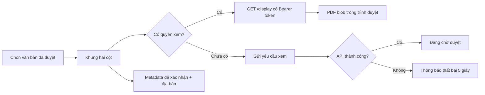
## Giai đoạn 34 — Bản xem trước upload hai cột

- Màn hình **Kiểm tra thông tin văn bản** sau upload được đổi sang hai cột: PDF từ tệp vừa tải lên ở bên trái, form metadata/tóm tắt/hành động/địa bàn có thể chỉnh sửa ở bên phải.
- Endpoint `/preview-display` chỉ cho người đã tải văn bản và đang quản lý bản nháp truy cập; không dùng URL công khai, không chờ văn bản được duyệt mới xem được tệp mình đã tải.
- Tệp PDF/ảnh hiển thị nguyên bản; DOCX/TXT có renderer PDF nội bộ để dùng cùng một khung xem. JSON bản nháp vẫn là dữ liệu tạm và bị xóa đúng vòng đời đã quy định.
- Kiểm tra: frontend build TypeScript thành công; backend regression 4/4 đạt sau khi rebuild container.

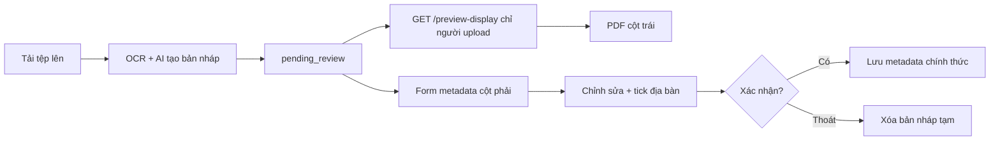
## Giai đoạn 35 — Chuông thông báo và phê duyệt yêu cầu xem bản gốc

- Chuông thông báo được móc nối vào app và dùng `DocumentAuditEvent` làm nguồn dữ liệu; không tạo bản sao nội dung audit log.
- Feed lọc theo quyền: cán bộ tỉnh nhận yêu cầu xem bản gốc; người gửi nhận kết quả duyệt/từ chối; các sự kiện công bố/khôi phục văn bản hiển thị theo quyền xem văn bản.
- Mỗi thẻ hiển thị avatar chữ cái, tên, chức vụ, tiêu đề, mô tả thân thiện và thời gian tương đối. Bảng `document_notification_reads` lưu trạng thái đọc riêng cho từng cán bộ, tạo badge chưa đọc trên chuông.
- Cán bộ tỉnh có nút **Duyệt** / **Từ chối** ngay trong thông báo; thao tác gọi API quyết định thật và ghi audit log. Thêm API danh sách yêu cầu đang chờ phục vụ các màn hình sau.
- Kiểm tra với dữ liệu thật: feed của `canbotinh@dienbien.gov.vn` thấy request ID `1` từ `canboxa@dienbien.gov.vn`, `actionable=true`; Alembic đã nâng lên migration `0004`; regression tests 4/4 đạt.

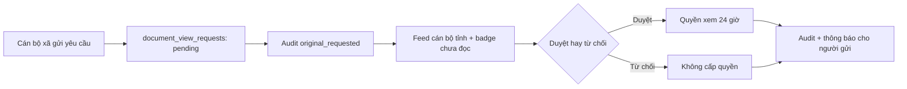
## Giai đoạn 36 — Xóa mềm và khôi phục văn bản

- Cán bộ tỉnh có nút **Xóa** trên khung chi tiết văn bản đã duyệt. Hệ thống luôn yêu cầu xác nhận trước khi chuyển bản ghi sang trạng thái `deleted`; tệp gốc mã hóa và metadata vẫn được giữ trong 30 ngày.
- Bộ lọc **Đã xóa** hiển thị các văn bản mà chính cán bộ đã thực hiện xóa. Trong khung chi tiết, cán bộ đó có thể dùng nút **Khôi phục** để đưa văn bản trở lại trạng thái đã duyệt trước khi hết thời hạn lưu giữ.
- Siết quyền API: người khác không thể truy vấn bản ghi đã xóa bằng ID; văn bản đã xóa cũng không còn cung cấp `/original` hay `/display`, kể cả khi một quyền xem cũ chưa hết hạn.
- Scheduler chạy mỗi giờ gọi `cleanup_expired_documents`; các văn bản xóa quá 30 ngày được xóa cả tệp lưu trữ và bản ghi CSDL. Không có văn bản thật nào bị xóa trong lúc kiểm tra triển khai.
- Kiểm tra: `python -m compileall` đạt, frontend Next.js build thành công, Docker backend/frontend khởi động ổn định và 4 regression tests backend đạt.

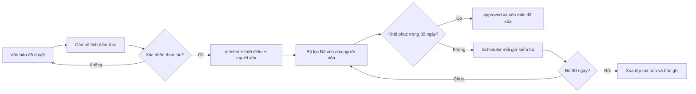
## Giai đoạn 37 — Thông báo xóa văn bản

- Bổ sung ánh xạ sự kiện audit `deleted` vào chuông thông báo. Thẻ thông báo dùng ngôn ngữ nghiệp vụ: **Văn bản đã được đưa vào mục đã xóa** và nêu rõ thời hạn lưu giữ 30 ngày.
- Thông báo chỉ hiển thị cho chính cán bộ đã xóa văn bản, khớp với quyền xem riêng của bộ lọc **Đã xóa**. Các cán bộ khác không nhận được metadata của văn bản đã xóa.
- Kiểm tra: backend compile thành công và container `greenforecast-backend` đã được rebuild/khởi động lại.

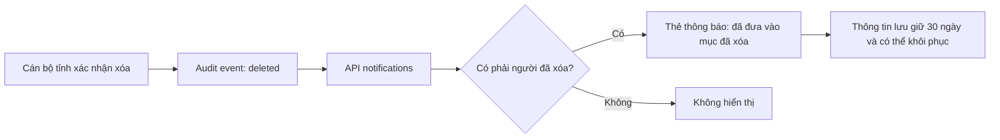
## Giai đoạn 38 — Phản ánh thông tin đa ngữ cảnh

- Thêm mục **Phản ánh thông tin** trên thanh điều hướng cho cán bộ đã đăng nhập. Cán bộ xã có thể gửi phản ánh với hạng mục tương ứng các khu vực nghiệp vụ, vị trí/đối tượng liên quan và mã văn bản đều là thông tin tùy chọn; mô tả vấn đề là bắt buộc.
- Cán bộ tỉnh xem toàn bộ phản ánh, chuyển trạng thái sang đang xử lý/đã xử lý/không tiếp nhận và bắt buộc ghi kết quả xử lý khi hoàn tất. Cán bộ xã chỉ xem được phản ánh do chính mình gửi.
- Chuông thông báo tổng hợp phản ánh mới cho cán bộ tỉnh, có trạng thái đã đọc riêng từng cán bộ. Không tiết lộ nội dung phản ánh cho người không có quyền tiếp nhận.
- Migration `0005_feedback` tạo bảng `feedback` và `feedback_notification_reads`; Docker entrypoint đã tự chạy Alembic lên head khi triển khai.
- Kiểm tra: frontend Next.js build thành công, backend compile thành công, Alembic ở `0005_feedback (head)` và regression tests backend đạt 4/4.

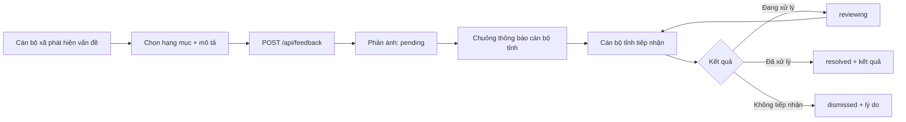
## Giai đoạn 39 — Kiểm chứng kết nối AI qua 9router

- Đã xác nhận `LLM_BASE_URL`, `LLM_API_KEY` và `LLM_MODEL` đều có cấu hình; adapter AI đã sẵn sàng gọi API theo chuẩn OpenAI-compatible và luôn trả thông báo nghiệp vụ thân thiện khi không phân tích được.
- Chẩn đoán với văn bản mẫu không nhạy cảm cho thấy lỗi là kết nối hạ tầng, không phải OCR/JSON: dịch vụ 9router/OpenClaw không lắng nghe tại `127.0.0.1:20128` trên máy chủ. Vì vậy backend Docker nhận `Connection refused` qua gateway `172.19.0.1`.
- Cấu hình backend đã chuẩn hóa đường gọi container → máy chủ là `http://172.19.0.1:20128/v1`. Để hoàn tất, cần chạy 9router/OpenClaw và cho API lắng nghe trên địa chỉ có thể truy cập từ Docker (ví dụ `0.0.0.0:20128`), sau đó thực hiện lại probe an toàn.

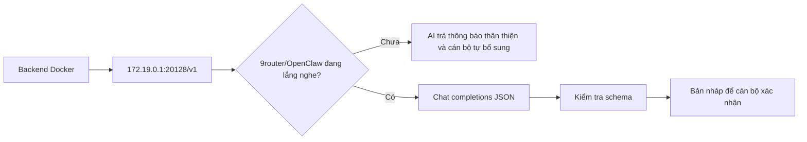
## Giai đoạn 40 — Hoàn tất kết nối model qua 9router

- Đã xác định 9router thực tế lắng nghe tại `0.0.0.0:20128`; cổng `20128` trên Windows và endpoint `/v1/models` đều phản hồi `200`.
- Sự cố còn lại là định tuyến Docker Desktop: `172.19.0.1` là gateway mạng Linux, không phải máy Windows. Backend đã đổi sang `http://host.docker.internal:20128/v1`, hostname được Docker Desktop phân giải tới `192.168.65.254` và đã kiểm tra truy cập thành công từ container.
- Probe cuối cùng dùng văn bản mẫu không nhạy cảm đã nhận JSON hợp lệ từ model. Adapter trả trạng thái `completed` cùng các trường: số văn bản, loại văn bản, cơ quan ban hành, hiệu lực, tóm tắt và việc cần thực hiện.
- Không in hoặc ghi khóa API vào log, source hay tài liệu cập nhật.

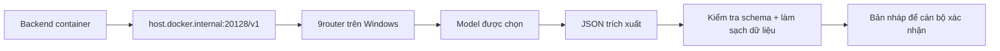
## Giai đoạn 41 — Chặn lỗi lưu văn bản thiếu ngày hiệu lực

- Chẩn đoán từ log cho thấy lỗi `IntegrityError` khi duyệt văn bản không phải lỗi SQLAlchemy: payload duyệt có `start_date = null` trong khi cột `documents.start_date` là bắt buộc.
- Hàm `validate_approval` trước đây chưa kiểm tra trường này. Đã thêm `start_date` vào dữ liệu bắt buộc và đổi thông báo kỹ thuật thành thông báo nghiệp vụ: **Cần xác nhận đủ: Hiệu lực từ ngày**.
- Giao diện kiểm tra văn bản cũng chặn ngay khi cán bộ bấm xác nhận mà bỏ trống ngày hiệu lực, giúp không cần gửi request lỗi tới server.
- Thêm regression test `test_document_approval_validation.py`. Harness tái hiện trước sửa từng chấp nhận `start_date=None`; sau sửa trả HTTP 422 đúng thông báo. Frontend build thành công, Docker đã rebuild và 5 backend tests đạt.

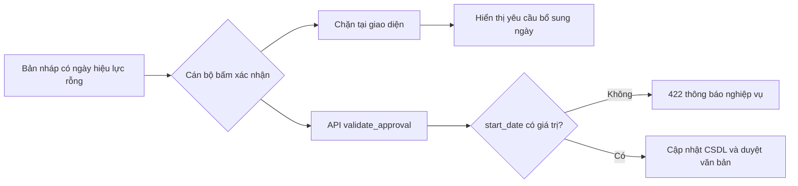
## Giai đoạn 42 — Ổn định kết nối Supabase PostgreSQL

- Chẩn đoán lỗi `SSL SYSCALL error: EOF detected`: đây là kết nối PostgreSQL/TLS bị Supabase Pooler đóng đột ngột trong lúc backend tái sử dụng `QueuePool`, không liên quan tới câu lệnh `SELECT documents` hay nội dung văn bản.
- Backend dùng Supabase Pooler tại cổng 5432 nhưng trước đây chưa bật kiểm tra kết nối sống. Đã thêm `pool_pre_ping=True` để loại bỏ kết nối stale trước mỗi checkout, `pool_recycle=1800` để thay kết nối cũ sau 30 phút và timeout kết nối/pool có giới hạn.
- Không thêm retry tự động cho lệnh ghi/duyệt văn bản nhằm tránh nguy cơ ghi hoặc audit trùng. Sự cố hạ tầng diện rộng vẫn được trả về rõ ràng thay vì che giấu.
- Thêm regression test `test_database_pool.py`; 6 backend tests đạt và loop 50 truy vấn `documents.id = 12` đạt 50/50, không có `SSL EOF`.

```mermaid
flowchart LR
  A[Request cần CSDL] --> B[SQLAlchemy QueuePool]
  B --> C{Kết nối TLS còn sống?}
  C -->|Có| D[Thực hiện truy vấn]
  C -->|Không / EOF| E[pool_pre_ping loại bỏ kết nối cũ]
  E --> F[Tạo kết nối Supabase mới]
  F --> D
  D --> G[Trả kết quả nghiệp vụ]
```
## Giai đoạn 43 — Sửa tương tác lưu nháp và xác nhận văn bản

- Tái hiện từ log với văn bản `13`: **Lưu bản nháp** đã gọi đúng `PUT /api/documents/13/preview` và nhận `200 OK`; không có `POST /approve` khi cán bộ bấm xác nhận vì bản nháp thiếu `start_date`.
- Bản nháp thiếu ngày hiệu lực do AI không nhận diện được trường này. Điều kiện chặn xác nhận là đúng nghiệp vụ nhưng trước đây UI không hướng dẫn đủ rõ, khiến thao tác có cảm giác không phản hồi.
- Tách trạng thái thao tác: lưu nháp chỉ hiển thị **Đang lưu bản nháp…**, xác nhận chỉ hiển thị **Đang xác nhận…**. Hai nút bị khóa đồng thời trong lúc có request để tránh đúp thao tác, nhưng không còn dùng sai nhãn.
- Khi thiếu ngày hiệu lực, giao diện highlight ô **Hiệu lực từ**, đưa focus đến ô này và nêu rõ yêu cầu; khi lưu nháp thành công, hiển thị thông báo xác nhận để cán bộ tiếp tục chỉnh sửa hoặc xác nhận.
- Kiểm tra: frontend TypeScript/Next.js build thành công và Docker backend/frontend đã được rebuild.

```mermaid
flowchart LR
  A[Cán bộ bấm Lưu bản nháp] --> B[PUT /preview]
  B --> C[Đang lưu bản nháp]
  C --> D[200 OK + thông báo đã lưu]
  E[Cán bộ bấm Xác nhận] --> F{Có Hiệu lực từ?}
  F -->|Không| G[Focus + highlight trường thiếu]
  F -->|Có| H[POST /approve]
  H --> I[Đang xác nhận]
  I --> J[Văn bản đã duyệt]
```
## Giai đoạn 44 — Hiển thị tiến độ xử lý văn bản

- Bổ sung trường `processing_stage` cho văn bản và migration `0006_document_processing_stage`.
- Background task cập nhật tiến độ theo từng bước: `queued` → `extracting_text` → `ocr` (khi cần) → `ai_analysis` → `ready` hoặc `failed`.
- API preview trả stage hiện tại trong HTTP 202; bản xem trước của cán bộ hiển thị thông điệp nghiệp vụ tương ứng thay vì một trạng thái chờ chung chung.
- Giữ nguyên nguyên tắc: tác vụ OCR/AI chạy nền, chỉ hiện form khi dữ liệu đã sẵn sàng; trạng thái xử lý không làm lộ nội dung tệp.
- Kiểm tra: Alembic đã lên `0006_document_processing_stage (head)`, frontend build thành công và 6 backend regression tests đạt.

```mermaid
flowchart LR
  A[Tải văn bản] --> B[queued]
  B --> C[extracting_text]
  C --> D{Có chữ trích xuất trực tiếp?}
  D -->|Không| E[ocr]
  D -->|Có| F[ai_analysis]
  E --> F
  F --> G{Thành công?}
  G -->|Có| H[ready / pending_review]
  G -->|Không| I[failed]
  H --> J[Hiển thị bản nháp để cán bộ kiểm tra]
```
## Giai đoạn 45 — Hoàn thiện danh sách địa bàn trong bản xem trước (31/07/2026)

- Bổ sung danh mục chuẩn gồm **45 xã/phường Điện Biên** vào backend, dựa trên bộ ranh giới hành chính năm 2025 đang dùng cho bản đồ của hệ thống.
- Thêm migration Alembic `0007_seed_dien_bien_communes_2025`: chỉ thêm các địa bàn chưa có, giữ nguyên ID, dữ liệu và liên kết tài khoản của 3 địa bàn mẫu hiện hữu.
- Thêm kiểm thử hồi quy để ngăn danh mục địa bàn bị rút xuống dưới 45 đơn vị trong các thay đổi sau này.
- Đồng bộ sequence ID PostgreSQL trước khi thêm dữ liệu tham chiếu, để các bản ghi mẫu tạo thủ công trên Supabase không thể gây trùng khóa chính.
- Dùng mã revision Alembic ngắn, tương thích giới hạn `VARCHAR(32)` của bảng phiên bản migration hiện hữu.

```mermaid
flowchart LR
    A["Bộ ranh giới hành chính 2025: 45 xã/phường"] --> B["Danh mục địa bàn chuẩn backend"]
    B --> C["Migration Alembic chỉ thêm địa bàn thiếu"]
    C --> D["GET /api/communes trả đủ 45 đơn vị"]
    D --> E["Bản xem trước hiển thị đủ ô chọn địa bàn"]
```

## Giai đoạn 46 — Hoàn thiện nhập và quản lý dữ liệu dân cư (31/07/2026)

- Làm rõ form thêm/sửa dân cư: nhãn trường nêu dữ liệu cần điền, còn placeholder chỉ hiển thị ví dụ; số điện thoại và họ tên được kiểm tra trước khi lưu.
- Bổ sung **Tải CSV mẫu**, hướng dẫn cấu trúc cột và giới hạn 500 bản ghi mỗi lần import.
- Import CSV hiện xử lý độc lập từng dòng hợp lệ: trả số bản ghi đã nhập, số bị bỏ qua và lý do theo số dòng (thiếu dữ liệu, sai số điện thoại, trùng trong tệp hoặc đã tồn tại).
- Tài khoản cán bộ xã hiển thị đúng xã/phường được phân công và backend chặn thao tác sửa/xóa dữ liệu ngoài địa bàn phụ trách.
- Kiểm tra: frontend production build thành công; 10 regression tests backend đạt, gồm luồng import và giới hạn quyền theo xã/phường.

```mermaid
flowchart LR
    A["Cán bộ chọn xã/phường và tệp CSV"] --> B["Kiểm tra hàng tiêu đề"]
    B --> C["Gửi từng dòng kèm số dòng nguồn"]
    C --> D{"Dữ liệu hợp lệ và không trùng?"}
    D -->|"Có"| E["Lưu bản ghi dân cư"]
    D -->|"Không"| F["Ghi lý do bỏ qua theo dòng"]
    E --> G["Báo cáo số đã nhập / bỏ qua"]
    F --> G
```

## Giai đoạn 47 — Xem toàn bộ dân cư và import đa địa bàn (31/07/2026)

- Bộ lọc xã/phường của cán bộ tỉnh mặc định là **Tất cả xã/phường**; không chọn địa bàn chỉ ảnh hưởng phạm vi xem, không còn làm danh sách trống hoặc chặn thao tác một cách mơ hồ.
- Form thêm dân cư của cán bộ tỉnh có ô chọn xã/phường ngay trong form, nên cán bộ vẫn thêm được người dân khi đang xem toàn bộ.
- CSV mẫu có cột `Xã/phường`; khi chưa lọc một địa bàn, backend đối chiếu tên xã/phường của từng dòng với danh mục chuẩn để nhập nhiều địa bàn trong một tệp.
- Nếu CSV thiếu cột địa bàn khi đang xem tất cả, giao diện chỉ rõ hai cách xử lý: thêm cột `Xã/phường` hoặc lọc một địa bàn trước khi import.
- Kiểm tra: frontend build thành công; 11 regression tests backend đạt, gồm đối chiếu địa bàn từ tên trong CSV.

```mermaid
flowchart LR
    A["Không chọn bộ lọc"] --> B["Hiển thị toàn bộ dân cư"]
    A --> C["CSV có cột Xã/phường"]
    C --> D["Đối chiếu tên với danh mục 45 địa bàn"]
    D --> E["Lưu từng dòng vào đúng xã/phường"]
    F["Đã chọn một địa bàn"] --> G["Áp dụng địa bàn đó cho toàn bộ tệp"]
```
